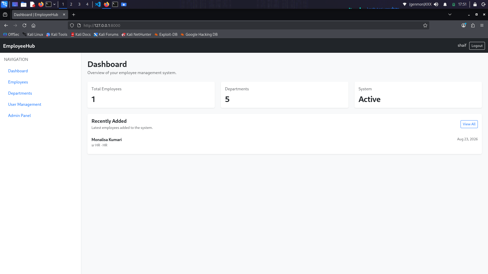
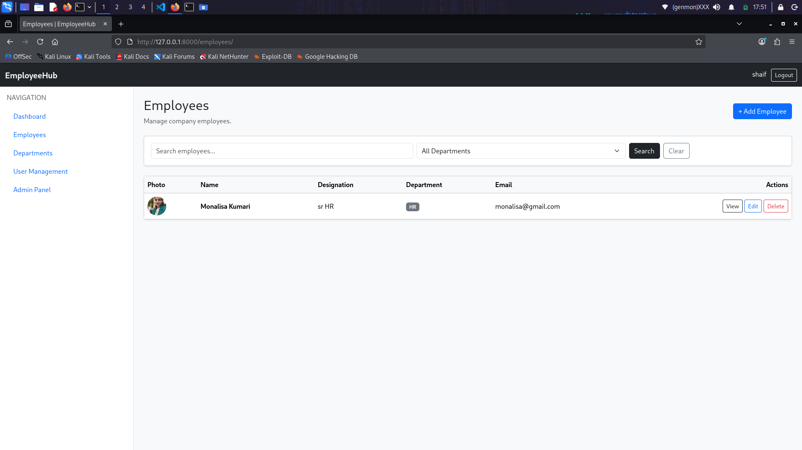
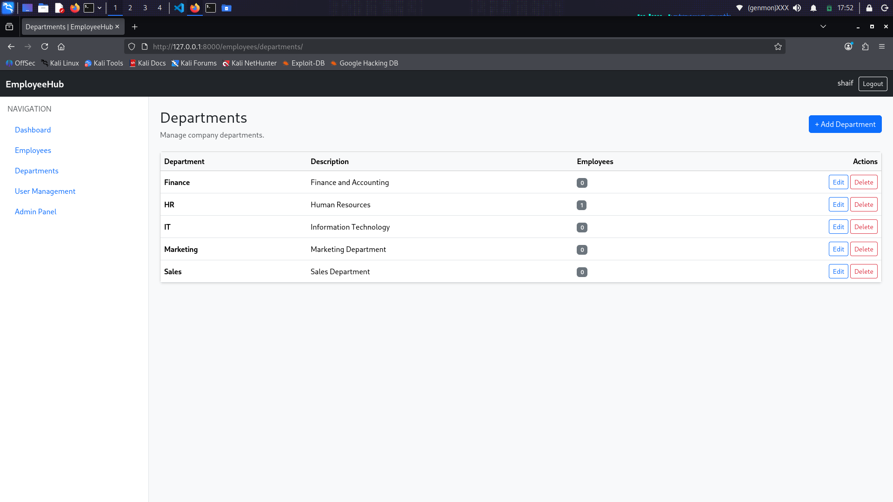
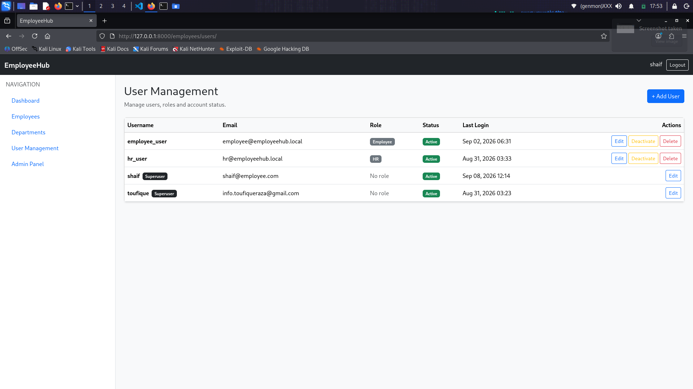

# EmployeeHub

A role-based Employee Management System built with Django.

## Features

- User authentication and logout
- Role-based access control (RBAC)
- Employee CRUD operations
- Department management
- User management
- Activate/deactivate user accounts
- Employee profile image upload
- Employee search
- Department filtering
- Pagination
- Server-side form validation
- Permission-based UI controls
- Custom 403 Access Denied page
- Dashboard statistics
- Responsive Bootstrap interface

## User Roles

| Role | Access |
|------|--------|
| Admin | Full employee, department and user management |
| HR | View, add and edit employees/departments |
| Employee | View employee information |

## Tech Stack

- Python
- Django
- SQLite
- HTML5
- CSS3
- Bootstrap
- Pillow
- Git & GitHub
- Linux

## Installation

```bash
git clone https://github.com/toufiqueraza/EmployeeHub.git
cd EmployeeHub
python3 -m venv venv
source venv/bin/activate
pip install -r requirements.txt
python manage.py migrate
python manage.py createsuperuser
python manage.py runserver
```


## Screenshots

### Dashboard


### Employee Management


### Department Management


### User Management & RBAC

